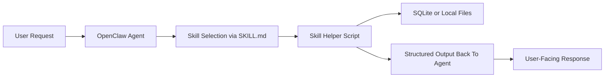

# OpenClaw Skill Suite

## Abstract

`openclaw-skill-suite` is a production-focused collection of four OpenClaw skills
designed for real daily workflows instead of demo-only prompts:

- `code-review-bot`
- `job-tracker`
- `expense-snap`
- `smart-scheduler`

The repository also includes validation, packaging, and publish-readiness checks
so each skill can be independently reviewed, tested, and published to ClawHub.

## Layman-Friendly Introduction

OpenClaw skills are not separate apps you click through. They are instruction
bundles that teach the agent how to solve a specific class of problems safely.
This project turns that idea into a small, practical toolbox:

- `code-review-bot` helps the agent inspect GitHub pull requests and summarize
  risks in a reviewer-friendly format.
- `job-tracker` helps track applications, deadlines, follow-ups, and recruiter
  contacts in one local database.
- `expense-snap` turns receipt information into a structured spending ledger and
  monthly summaries.
- `smart-scheduler` manages meeting requests, proposed time slots, confirmations,
  and ICS calendar exports.

The suite is deliberately local-first. Persistent state lives in SQLite, helper
logic is implemented in Python standard library scripts, and the skills are
packaged as plain text files so they remain easy to audit before publication.

## System Explanation

Each skill follows the same layered design:

1. `SKILL.md` tells OpenClaw when to use the skill and how to invoke it safely.
2. `scripts/` contains the operational helper logic for deterministic tasks.
3. `references/` contains extra instructions, checklists, or classification rules.
4. `test_*.py` verifies the skill behavior in isolation.
5. Repo-level tooling validates frontmatter, allowed files, publish limits, and
   metadata/runtime consistency before publication.



### Repository Layout

```text
openclaw-skill-suite/
  docs/
  skills/
    code-review-bot/
    expense-snap/
    job-tracker/
    smart-scheduler/
  tests/
  tools/
```

## Performance And Validation

This repository avoids placeholder benchmark claims. Validation is grounded in:

- Node-based contract tests for skill discovery, frontmatter validation, and
  package eligibility.
- Python unit tests for each skill's deterministic helper logic.
- Bundle inspection to ensure only publish-safe text files are present and total
  skill size stays under ClawHub limits.
- Manual publish-readiness documentation for the credential-gated final step.

Verified locally on March 23, 2026:

- 4 skills discovered and validated by the TypeScript contract gate.
- 3 repo-level Vitest checks covering discovery, publish safety, and bundle size.
- 6 Python unit tests covering review rendering, expense exports, job tracking,
  and scheduling/ICS export.
- Companion upstream OpenClaw UI verification:
  - targeted browser regression test for workspace-vs-bundled grouping
  - production UI build for the Control Panel bundle

Current verification command:

```bash
corepack pnpm install
corepack pnpm check
```

## Deployment And Publish Guide

The suite is designed to be published skill-by-skill rather than as a monolith.

1. Install dependencies:

   ```bash
   corepack pnpm install
   ```

2. Run validation and tests:

   ```bash
   corepack pnpm check
   ```

3. Authenticate the ClawHub CLI when credentials are available:

   ```bash
   corepack pnpm exec clawhub login
   corepack pnpm exec clawhub whoami
   ```

4. Publish each skill directory:

   ```bash
   corepack pnpm exec clawhub publish skills/code-review-bot --slug code-review-bot --name "Code Review Bot" --version 0.1.0 --tags latest --changelog "Initial release"
   ```

Detailed publication and moderation notes live in [docs/publishing.md](docs/publishing.md).

## Development Notes

- The suite uses `pnpm` for Node tooling and `python -m unittest` for skill tests.
- Each skill must remain independently publishable. Runtime logic must not depend
  on shared root scripts.
- Homepages are intentionally deferred until the public repository URL is fixed.
- Any environment variables referenced by scripts must be declared in skill
  metadata to avoid ClawHub moderation mismatches.

## References

- [OpenClaw repository](https://github.com/openclaw/openclaw)
- [ClawHub repository](https://github.com/openclaw/clawhub)
- [OpenClaw skills docs](https://docs.openclaw.ai/tools/skills)
- [ClawHub skill format](https://github.com/openclaw/clawhub/blob/main/docs/skill-format.md)
- [ClawHub quickstart](https://github.com/openclaw/clawhub/blob/main/docs/quickstart.md)
